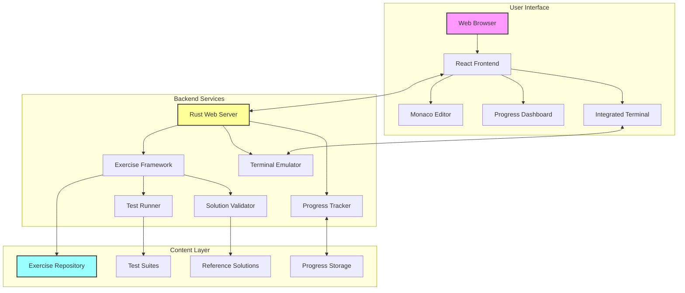

# Rust Tour


An interactive Rust learning platform featuring progressive exercises aligned with "The Rust Programming Language" book.

[](https://github.com/ghanithan/rust-tour/actions)
[](LICENSE)

## Overview

Rust Tour is a comprehensive learning platform that combines theoretical knowledge from the official Rust Book with hands-on coding exercises. It provides a structured pathway for developers to master Rust through progressive, test-driven exercises.

## Key Features

- **Progressive Learning Path**: 200+ exercises across 20 chapters following the Rust Book structure
- **Test-Driven Development**: Each exercise includes comprehensive test suites
- **Interactive Web Interface**: Monaco editor with syntax highlighting and live feedback
- **Integrated Terminal**: Built-in terminal for running Rust commands directly
- **Smart Progress Tracking**: JSON-based progress persistence with learning analytics
- **Multiple Exercise Types**: Code completion, bug fixing, from-scratch implementation, code review, and performance optimization
- **Adaptive Difficulty**: Exercises scale from beginner to advanced within each chapter
- **Community Driven**: Open-source platform with contribution workflows

[🚀 **Get Started** → Jump to Installation Methods](#installation-methods)

## Built with Claude Code

This entire project was created using [Claude Code](https://claude.ai/code) in GitHub Codespaces - a delightful paradox worth noting! We've used AI to build a platform that champions traditional, hands-on learning. While AI helped architect the codebase, generate exercises, and design the learning framework, **the fundamental truth remains**: programming mastery requires human understanding, critical thinking, and practice.

### The Beautiful Contradiction

It's wonderfully ironic - an AI helped create a platform that emphasizes the irreplaceable value of human programming knowledge. This collaboration highlights a crucial principle: **AI amplifies human expertise but cannot replace it**. Every line of code generated was reviewed, refined, and validated by human judgment. Every exercise was crafted to build real understanding, not just pattern matching.

### Why Programming Knowledge Still Matters

Even in an AI-enhanced world, deep programming knowledge remains essential:

- **Verification**: You need to understand code to validate AI output
- **Architecture**: System design requires human creativity and judgment  
- **Problem Solving**: Breaking down complex problems is a uniquely human skill
- **Quality Assurance**: Recognizing good vs. problematic code requires experience
- **Innovation**: Building novel solutions demands understanding fundamentals

### The Claude Code Experience

This project demonstrates the productive partnership between human developers and AI:

- **Rapid Prototyping**: Ideas became working code in minutes
- **Documentation Excellence**: Comprehensive guides generated efficiently  
- **Best Practices**: AI knowledge of patterns combined with human oversight
- **Creative Problem Solving**: Human creativity directed by AI implementation
- **Quality Assurance**: Human validation ensuring production-ready results

**Built entirely in GitHub Codespaces with Claude Code** - proving that the future of development is collaborative intelligence, where AI and human expertise create something greater than either could achieve alone.

---

*"The best tools amplify human capability rather than replace it. Rust Tour stands as testament to this principle."*

## 🚀 Why We Recommend GitHub Codespaces

**GitHub Codespaces provides the ideal environment for learning Rust** - eliminating setup friction so you can focus entirely on mastering the language. Here's why we strongly advocate for using Codespaces:

### ✅ **Zero Setup Barrier**
- **No local installation required** - Start coding in seconds
- **Pre-configured environment** - Rust toolchain, VS Code extensions, and all dependencies ready
- **Consistent experience** - Same environment for every learner, regardless of their operating system
- **Instant access** - Works on any device with a web browser

### 💰 **Generous Free Tier (2025)**
**GitHub Free Personal Accounts include:**
- **120 core hours per month** (60 hours of runtime on a 2-core machine)
- **15 GB of storage** per month
- **No payment method required** to get started
- **Automatic notifications** when approaching usage limits

**For context:** 60 hours per month is more than sufficient for:
- Completing all Rust Tour exercises
- Building several practice projects
- Experimenting with advanced Rust concepts
- Contributing to open-source projects

### 🎯 **Perfect for Learning**
- **Eliminate environment issues** - No wrestling with PATH variables, compiler versions, or missing dependencies
- **Focus on concepts** - Spend time learning Rust, not debugging setup problems
- **Collaborative learning** - Share your exact environment with instructors or study groups
- **Cross-platform consistency** - Same experience on Windows, Mac, or Linux

### 📚 **Educational Benefits**
- **Immediate productivity** - Start learning Rust concepts from minute one
- **Professional workflow** - Experience industry-standard development tools
- **Version control integration** - Built-in Git workflow teaches best practices
- **Real development environment** - Not a limited sandbox or tutorial platform

### 🔗 **Official References**
- **Codespaces Documentation**: [docs.github.com/codespaces](https://docs.github.com/codespaces/overview)
- **Billing Information**: [GitHub Codespaces Billing](https://docs.github.com/billing/managing-billing-for-github-codespaces/about-billing-for-github-codespaces)
- **Getting Started**: [GitHub Codespaces Features](https://github.com/features/codespaces)

---

### 💡 **Transparency Disclaimer**

*We are not sponsored by or affiliated with GitHub in any way. This recommendation comes purely from our commitment to reducing barriers to learning Rust. After extensive testing of various development environments, GitHub Codespaces consistently provides the smoothest onboarding experience for new Rust developers. Our goal is simple: help you start writing Rust code as quickly as possible, with minimal friction.*

---

## Installation Methods

### GitHub Codespaces (Recommended)

**With Progress Tracking (Recommended):**
1. Fork this repository to your GitHub account
2. Navigate to your fork and click "Code" → "Create codespace on main"
3. Wait for environment initialization (2-3 minutes)
4. Start the application:
   ```bash
   ./scripts/run.sh start
   ```
5. Access the web interface:
   - **Automatic**: Codespaces will show a popup notification with a link to open the forwarded port
   - **Manual**: Click the "Ports" tab in VS Code and open the forwarded URL for port 3000
   - **Direct**: Access at `http://localhost:3000` if running locally
6. Your progress will be saved to your fork automatically

**Without Progress Tracking:**
1. Navigate to the main repository and click "Code" → "Create codespace on main"
2. Wait for environment initialization (2-3 minutes)
3. Start the application:
   ```bash
   ./scripts/run.sh start
   ```
4. Access the web interface:
   - **Automatic**: Codespaces will show a popup notification with a link to open the forwarded port
   - **Manual**: Click the "Ports" tab in VS Code and open the forwarded URL for port 3000

### Docker Installation

**Using Docker Compose (Recommended):**
1. Clone the repository:
   ```bash
   git clone https://github.com/ghanithan/rust-tour.git
   cd rust-tour
   ```

2. Start with Docker Compose:
   ```bash
   docker-compose up -d
   ```

3. Access the application at `http://localhost:3000`

4. Stop the application:
   ```bash
   docker-compose down
   ```

**Using Docker directly:**
```bash
# Build and run
docker build -t rust-tour .
docker run -d \
  --name rust-tour \
  -p 3000:3000 \
  -v $(pwd)/progress:/app/progress \
  rust-tour

# Management commands
docker logs rust-tour
docker stop rust-tour && docker rm rust-tour
```

**Using Pre-built Images from GitHub Container Registry:**

*For stable releases (recommended for production):*
```bash
# Docker Compose with latest stable release
docker-compose -f docker-compose.ghcr.yml up -d

# Or direct Docker run
docker run -d \
  --name rust-tour \
  -p 3000:3000 \
  -v $(pwd)/progress:/app/progress \
  ghcr.io/ghanithan/rust-tour:latest
```

*For development/testing with latest main branch:*
```bash
# Use latest development build from main branch
docker run -d \
  --name rust-tour-dev \
  -p 3000:3000 \
  -v $(pwd)/progress:/app/progress \
  ghcr.io/ghanithan/rust-tour:main-latest
```

**Available image tags:**
- `latest` - Latest stable release (from version tags)
- `v0.1.0` - Specific version releases
- `0.1` - Latest patch in minor version series  
- `0` - Latest minor in major version series
- `main-latest` - Latest development build from main branch
- `main-abc123` - Specific commit from main branch

**For Development:**
```bash
# Use the development Docker setup with hot reload
docker-compose -f docker-compose.dev.yml up

# This provides:
# - Live code reloading
# - Development tools (cargo-watch, etc.)
# - Both Rust server (3000) and Vite dev server (5173)
```

### Cargo Installation (Recommended for End Users)

```bash
# Install Rust Tour
cargo install rust-tour

# Start learning
rust-tour
```

**First-time setup:**
- On first run, Rust Tour will guide you through downloading the exercises
- You'll choose where to store your exercises and progress (default: `~/rust-tour-exercises`)
- Download size is approximately 5MB and takes 10-30 seconds
- Your progress is automatically saved between sessions

**What happens on first run:**
1. Welcome screen with information about the exercises
2. Prompt to download exercises from GitHub
3. Choose your preferred storage location
4. Automatic download and setup
5. Server starts with the web interface at `http://localhost:3000`

**Subsequent runs:**
- Rust Tour remembers your exercise location
- Starts immediately without any prompts
- All your progress is preserved

**Command-line options:**
```bash
rust-tour --help                    # Show help and available options
rust-tour --port 8080              # Use a custom port
rust-tour --exercises-path /path   # Use exercises from a specific location
```

### Local Repository Installation (End Users)

For using the pre-built application:
1. **Prerequisites**: Git only
2. **Clone and run**:
   ```bash
   git clone https://github.com/ghanithan/rust-tour.git
   cd rust-tour
   ./scripts/run.sh start
   ```
3. Access the application at `http://localhost:3000`

### Local Development Installation (Contributors)

For development and customization:
1. **Prerequisites**:
   - Rust toolchain (1.75.0 or later)
   - Node.js (18.0 or later)
   - Git

2. **Clone and setup**:
   ```bash
   git clone https://github.com/ghanithan/rust-tour.git
   cd rust-tour
   ./scripts/run.sh setup
   ```

3. **Start development servers**:
   ```bash
   ./scripts/run.sh dev
   ```
   This starts both the Rust server and web development server with hot reloading.

## Working with Exercises

### Exercise Structure

Each exercise is a standalone Cargo project located in the `exercises/` directory:

```
exercises/
├── ch01_getting_started/
│   ├── ex01_hello_world/
│   │   ├── Cargo.toml
│   │   ├── README.md
│   │   ├── metadata.json
│   │   ├── src/main.rs
│   │   ├── tests/unit_tests.rs
│   │   └── hints.md
│   └── ex02_hello_cargo/
└── ch02_guessing_game/
```

### Running Tests for Individual Exercises

Navigate to any exercise directory and run tests:

```bash
# Navigate to specific exercise
cd exercises/ch01_getting_started/ex01_hello_world

# Run all tests for this exercise
cargo test

# Run tests with output displayed
cargo test -- --nocapture

# Run a specific test
cargo test test_hello_world_output

# Check your solution
cargo run

# Verify code quality
cargo clippy -- -D warnings
cargo fmt --check
```

### Checking Exercise Solutions

```bash
# Run tests to validate your solution
cargo test

# Check code quality
cargo clippy -- -D warnings
cargo fmt --check

# Or manually compare with reference solution (if available)
diff src/main.rs ../../../solutions/ch01/ex01/main.rs
```

## Architecture



### Component Overview

- **Web Interface** (`web/`): TypeScript/React application providing the interactive learning environment
- **Web Server** (`web-server/`): Rust-based backend handling API requests and terminal emulation
- **Exercise Framework** (`exercise-framework/`): Core logic for exercise validation and progress tracking
- **Exercises** (`exercises/`): Structured learning content with tests and hints
- **Scripts** (`scripts/`): Automation tools for development and exercise management

## Learning Path

The curriculum follows "The Rust Programming Language" book structure:

1. **Getting Started** - Basic syntax and tooling
2. **Programming a Guessing Game** - First complete program
3. **Common Programming Concepts** - Variables, types, functions, control flow
4. **Understanding Ownership** - Rust's core memory management concept
5. **Using Structs** - Custom data types
6. **Enums and Pattern Matching** - Algebraic data types
7. **Managing Growing Projects** - Modules, packages, and crates
8. **Common Collections** - Vectors, strings, hash maps
9. **Error Handling** - Result and Option types
10. **Generic Types, Traits, and Lifetimes** - Advanced type system features

Each chapter contains 5-15 exercises progressing from basic to advanced concepts.

## Development Workflow

### Running the Full Test Suite

```bash
# Run all exercise tests
./scripts/run.sh test

# Run framework tests
cargo test --workspace

# Run web tests (if in development mode)
cd web && npm test

# Test Docker build
docker build -t rust-tour-test .
```

### Docker Development Commands

```bash
# Build Docker image with automated script
./scripts/build-docker.sh

# Test the built image
./scripts/test-docker.sh

# Manual build and run
docker build -t rust-tour .
docker run -d \
  --name rust-tour \
  -p 3000:3000 \
  -v $(pwd)/progress:/app/progress \
  rust-tour

# Development with volume mounts
docker run -d \
  --name rust-tour-dev \
  -p 3000:3000 \
  -v $(pwd)/exercises:/app/exercises:ro \
  -v $(pwd)/progress:/app/progress \
  rust-tour

# View container logs and management
docker logs -f rust-tour
docker exec -it rust-tour sh
docker stop rust-tour && docker rm rust-tour
```

### Creating New Exercises

```bash
# Manually create the structure
mkdir -p exercises/ch04_understanding_ownership/ex05_ownership_puzzle
cd exercises/ch04_understanding_ownership/ex05_ownership_puzzle
cargo init

# Add test structure
mkdir tests
touch tests/unit_tests.rs hints.md README.md metadata.json
```

### Release Process

We use an automated release process with AI-generated release notes:

**Creating a Release:**
1. Go to **Actions** tab in GitHub
2. Run **"Create Release"** workflow
3. Enter version number (e.g., `0.1.0`)
4. Select release type (`patch`, `minor`, `major`)
5. The workflow will:
   - Run full validation suite
   - Generate AI-powered release notes
   - Create git tag and GitHub release
   - Trigger Docker image builds automatically

**Manual Release Steps (Alternative):**
```bash
# Create and push a version tag
git tag v0.1.0
git push origin v0.1.0

# This automatically triggers the release workflow
# Docker images will be built and published to GHCR
```

**Release Artifacts:**
- **GitHub Release** with generated changelog
- **Docker Images** on GHCR:
  - `ghcr.io/ghanithan/rust-tour:latest`
  - `ghcr.io/ghanithan/rust-tour:v0.1.0`
  - `ghcr.io/ghanithan/rust-tour:0.1`
  - `ghcr.io/ghanithan/rust-tour:0`

### Code Quality Standards

All contributions must pass:

```bash
# Rust formatting
cargo fmt --all -- --check

# Rust linting
cargo clippy --all-targets --all-features -- -D warnings

# JavaScript/TypeScript
cd web && npm run lint

# Docker build test
docker build -t rust-tour-test .
```

## Contributing

We welcome contributions from the community. Please read our [Contributing Guide](CONTRIBUTING.md) for details on:

- Code style and standards
- Exercise creation guidelines
- Testing requirements
- Pull request process

### Quick Contribution Checklist

1. Fork the repository and create a feature branch
2. Write tests for any new functionality
3. Ensure all tests pass locally
4. Update documentation as needed
5. Submit a pull request with clear description

### Areas for Contribution

- **New Exercises**: Expand existing chapters or propose new topics
- **Improved Hints**: Enhance the progressive hint system
- **UI/UX Improvements**: Better visualization and interactivity
- **Performance Optimizations**: Speed up test execution and validation
- **Documentation**: Tutorials, guides, and API documentation
- **Translations**: Localize content for non-English speakers

## Technical Requirements

### Minimum System Requirements

- **OS**: Linux, macOS, or Windows (with WSL2)
- **RAM**: 4GB minimum, 8GB recommended
- **Disk**: 2GB free space
- **Network**: Internet connection for initial setup

### Supported Browsers

- Chrome/Chromium 90+
- Firefox 88+
- Safari 14+
- Edge 90+

## License

This project is dual-licensed under either:

- Apache License, Version 2.0 ([LICENSE-APACHE](LICENSE-APACHE))
- MIT license ([LICENSE-MIT](LICENSE-MIT))

You may choose either license for your use of this software.

## Acknowledgments

- **Claude Code** for being an exceptional AI pair programming partner
- **GitHub Codespaces** for providing the perfect development environment
- The Rust Team for creating an exceptional language and comprehensive documentation
- The Rust community for continuous feedback and contributions
- All contributors who help improve this learning platform

## Documentation

For comprehensive guides, tutorials, and detailed documentation, visit our **[Wiki](https://github.com/ghanithan/rust-tour/wiki)** which includes:

- **[Installation & Setup Guide](https://github.com/ghanithan/rust-tour/wiki/Installation-&-Setup)** - Detailed installation for all platforms
- **[Exercise Guide](https://github.com/ghanithan/rust-tour/wiki/Exercise-Guide)** - How to work with exercises effectively
- **[Contributing Guide](https://github.com/ghanithan/rust-tour/wiki/Contributing-Guide)** - Guidelines for contributors
- **[FAQ & Troubleshooting](https://github.com/ghanithan/rust-tour/wiki/FAQ)** - Solutions to common issues

## Support

- **Issues**: Report bugs via [GitHub Issues](https://github.com/ghanithan/rust-tour/issues)
- **Discussions**: Join our [GitHub Discussions](https://github.com/ghanithan/rust-tour/discussions)
- **Documentation**: Visit our [Wiki](https://github.com/ghanithan/rust-tour/wiki)

---

Ready to begin your Rust journey? Start with Chapter 1 or jump to any topic that interests you!