# CI/CD Workflow Documentation

This document describes the comprehensive CI/CD pipeline for Rust Tour, implemented as staged GitHub Actions workflows.

## Workflow Overview

The CI/CD pipeline consists of 8 main stages that ensure code quality, security, and reliable deployments:

```mermaid
graph TD
    A[Code Push/PR] --> B[Stage 1: Test & Lint]
    B --> C[Stage 2: Security Audit]
    C --> D[Stage 3: Build Artifacts]
    C --> E[Stage 4: Docker Build]
    D --> F[Stage 5: Publish to Cargo]
    E --> G[Stage 6: GitHub Release]
    E --> H[Stage 7: Deploy Staging]
    E --> I[Stage 8: Integration Tests]
    
    B --> J{Tests Pass?}
    J -->|No| K[❌ Fail Pipeline]
    J -->|Yes| C
    
    style B fill:#e1f5fe
    style C fill:#fff3e0
    style D fill:#f3e5f5
    style E fill:#f3e5f5
    style F fill:#e8f5e8
    style G fill:#e8f5e8
    style H fill:#fff8e1
    style I fill:#fff8e1
```



## Stage Details

### Stage 1: Test and Lint
**Triggers**: All pushes and pull requests
**Purpose**: Ensure code quality and functionality

**Actions**:
- Rust code formatting check (`cargo fmt`)
- Rust linting (`cargo clippy`)
- Web code linting (`npm run lint`)
- Rust unit tests (`cargo test`)
- Web unit tests (`npm test`)
- Exercise validation
- Multi-version testing (stable + beta Rust)

**Matrix Strategy**:
- Tests on Rust stable (required) and beta (allowed to fail)
- Ensures compatibility with future Rust versions

### Stage 2: Security Audit
**Triggers**: After successful tests on main/tag pushes
**Purpose**: Identify security vulnerabilities

**Actions**:
- Cargo security audit (`cargo audit`)
- NPM security audit (`npm audit`)
- Dependency vulnerability scanning

### Stage 3: Build Release Artifacts
**Triggers**: Main branch pushes and version tags
**Purpose**: Create platform-specific binaries

**Platforms**:
- `x86_64-unknown-linux-gnu` (Linux)
- `x86_64-apple-darwin` (macOS)
- `x86_64-pc-windows-msvc` (Windows)

**Features**:
- Embedded web assets (`--features embed-assets`)
- Optimized release builds
- Compressed archives (tar.gz/zip)

### Stage 4: Docker Build and Publish
**Triggers**: Main branch pushes and version tags
**Purpose**: Create and publish container images

**Features**:
- Multi-stage Docker build
- Multi-architecture support (amd64, arm64)
- Publishes to GitHub Container Registry (ghcr.io)
- Automated tagging strategy
- Build cache optimization

**Image Tags**:
- `latest` (main branch)
- `main` (main branch)
- `v1.2.3` (version tags)
- `v1.2` (minor version tags)
- `v1` (major version tags)
- `sha-abc123` (commit SHA)

### Stage 5: Publish to Cargo
**Triggers**: Version tags only (`v*`)
**Purpose**: Publish to crates.io registry

**Requirements**:
- `CARGO_REGISTRY_TOKEN` secret must be configured
- Version tag must match Cargo.toml version
- All tests must pass

### Stage 6: GitHub Release
**Triggers**: Version tags only
**Purpose**: Create GitHub releases with artifacts

**Includes**:
- All platform binaries
- Automated release notes
- Docker installation instructions
- Cargo installation instructions

### Stage 7: Deploy to Staging
**Triggers**: Main branch pushes only
**Purpose**: Automatic staging deployment

**Features**:
- Uses latest Docker image
- Environment-specific configuration
- Can be extended with actual deployment scripts

### Stage 8: Integration Tests
**Triggers**: After Docker build completion
**Purpose**: End-to-end testing of the complete application

**Tests**:
- Service health checks
- API endpoint validation
- Exercise loading verification
- Basic performance testing

## Secrets Configuration

The following secrets must be configured in GitHub repository settings:

| Secret | Purpose | Required For |
|--------|---------|--------------|
| `CARGO_REGISTRY_TOKEN` | Publishing to crates.io | Cargo publishing |
| `GITHUB_TOKEN` | Automated (GitHub provides) | Container registry, releases |

## Workflow Files

### Main CI/CD Pipeline
- **File**: `.github/workflows/ci-cd.yml`
- **Triggers**: Push, PR, tags
- **Purpose**: Main build and deployment pipeline

### Cleanup Workflow
- **File**: `.github/workflows/cleanup.yml`
- **Triggers**: Weekly schedule, manual
- **Purpose**: Clean up old artifacts and container images

## Branch Strategy

### Main Branch (`main`)
- All stages execute
- Docker images tagged as `latest` and `main`
- Deploys to staging environment
- Requires all checks to pass

### Feature Branches
- Only test and lint stages execute
- No deployment or publishing
- Must pass all checks for PR merge

### Version Tags (`v*`)
- Full pipeline execution
- Publishes to Cargo and GitHub releases
- Creates stable Docker images
- Suitable for production deployment

## Container Registry

Images are published to GitHub Container Registry (ghcr.io):

```bash
# Pull latest development image
docker pull ghcr.io/ghanithan/rust-tour:main

# Pull specific version
docker pull ghcr.io/ghanithan/rust-tour:v1.0.0

# Pull latest stable
docker pull ghcr.io/ghanithan/rust-tour:latest
```

## Local Development

### Using Docker Compose

```bash
# Start production-like environment
docker-compose up -d

# Start development environment with hot reload
docker-compose --profile dev up -d

# View logs
docker-compose logs -f

# Clean up
docker-compose down
```

### Development Dockerfile

The `Dockerfile.dev` provides a development environment with:
- Hot reload capabilities
- Development tools (cargo-watch, cargo-edit)
- Debug logging
- Volume mounts for live code editing

## Performance Considerations

### Build Optimization
- **Rust caching**: Uses `Swatinem/rust-cache` for dependency caching
- **NPM caching**: Caches node_modules between builds
- **Docker layer caching**: Multi-stage builds with optimal layer ordering
- **Parallel builds**: Matrix strategy for concurrent platform builds

### Security Measures
- **Non-root containers**: Final images run as non-root user
- **Minimal base images**: Alpine Linux for small attack surface
- **Security scanning**: Automated vulnerability detection
- **Dependency auditing**: Regular security audits

### Monitoring and Observability
- **Health checks**: Container health monitoring
- **Build artifacts**: Comprehensive build artifacts retention
- **Logging**: Structured logging with configurable levels
- **Metrics**: Build time and success rate tracking

## Maintenance

### Regular Tasks
- **Weekly cleanup**: Automated artifact and image cleanup
- **Security updates**: Regular dependency updates
- **Performance monitoring**: Build time optimization
- **Documentation updates**: Keep workflow docs current

### Troubleshooting

#### Failed Tests
1. Check test logs in GitHub Actions
2. Run tests locally: `cargo test --workspace`
3. Fix issues and push again

#### Docker Build Failures
1. Verify Dockerfile syntax
2. Check for missing dependencies
3. Test build locally: `docker build -t rust-tour .`

#### Publishing Failures
1. Verify secrets are configured
2. Check version tag format
3. Ensure crates.io token is valid

#### Deployment Issues
1. Check deployment logs
2. Verify image availability
3. Test container locally

This CI/CD pipeline ensures reliable, secure, and automated delivery of Rust Tour across multiple platforms and deployment scenarios.