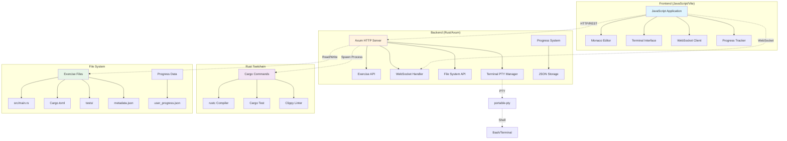
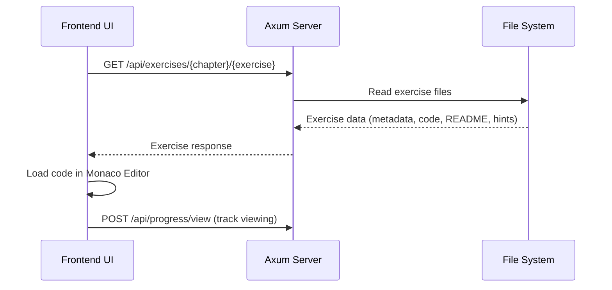
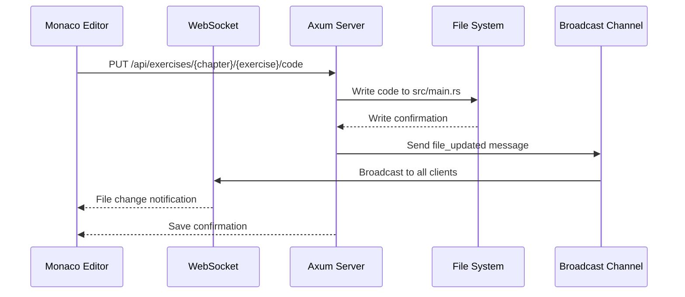
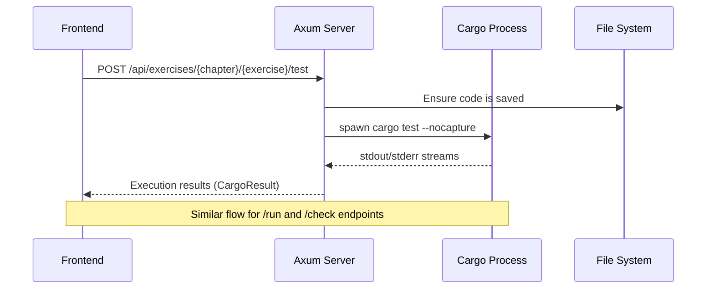

# Rust Tour - Technical Architecture Documentation

## Project Overview

Rust Tour is an interactive Rust learning platform that provides progressive, exercise-based education following "The Rust Programming Language" book structure. The platform combines a modern Rust web server with real-time WebSocket communication and an integrated terminal experience.

## System Architecture Overview



## Architecture Decisions

### ADR-001: Remove Unused Exercise Framework
**Status**: Proposed  
**Date**: 2025-07-28  
**Link**: [ADR-001-Remove-Exercise-Framework.md](./ADR-001-Remove-Exercise-Framework.md)

The `exercise-framework` was created as a sophisticated abstraction layer for exercise management but was never integrated. The project evolved to use simpler, direct approaches that work perfectly well. This ADR documents the decision to remove this unused technical debt.

## Core Architecture Components

### 1. Rust Backend Server (Axum Framework)

**Technology Stack:**
- **Axum**: Modern async web framework
- **Tokio**: Async runtime for concurrent operations
- **WebSocket**: Real-time bidirectional communication
- **portable-pty**: Cross-platform terminal integration
- **serde**: JSON serialization/deserialization

**Server Structure:**
```
web-server/src/
├── main.rs              # Main server application
├── Cargo.toml          # Dependencies and features
└── web-dist/           # Embedded frontend assets (optional)
```

### 2. Frontend Application

**Technology Stack:**
- **TypeScript/React**: Modern web application framework
- **Monaco Editor**: VSCode-based code editor with Rust syntax
- **WebSocket API**: Real-time communication with backend
- **CSS Grid**: Responsive layout system

**Frontend Structure:**
```
web/src/
├── components/         # React components
├── hooks/             # Custom React hooks
├── services/          # API and WebSocket services
├── styles/            # CSS modules
└── utils/             # Helper functions
```

## Code Editing, Saving, and Testing Flow

### 1. Exercise Loading Flow



**API Endpoint**: `GET /api/exercises/{chapter}/{exercise}`

**Backend Implementation:**
```rust
async fn get_exercise(
    AxumPath((chapter, exercise)): AxumPath<(String, String)>,
    State(state): State<AppState>,
) -> Result<Json<ExerciseDetails>, StatusCode> {
    let exercise_path = state.exercises_path.join(&chapter).join(&exercise);
    
    // Read all exercise files
    let metadata = read_metadata(&exercise_path)?;
    let main_content = read_main_rs(&exercise_path)?;
    let readme = read_readme(&exercise_path)?;
    let hints = read_hints(&exercise_path)?;
    
    Ok(Json(ExerciseDetails {
        metadata,
        main_content,
        readme,
        hints,
        path: format!("{}/{}", chapter, exercise),
    }))
}
```

### 2. Code Saving Flow



**API Endpoint**: `PUT /api/exercises/{chapter}/{exercise}/code`

**Backend Implementation:**
```rust
async fn save_exercise_code(
    AxumPath((chapter, exercise)): AxumPath<(String, String)>,
    State(state): State<AppState>,
    Json(request): Json<SaveCodeRequest>,
) -> Result<Json<ApiResponse<()>>, StatusCode> {
    let exercise_path = state.exercises_path.join(&chapter).join(&exercise);
    let main_path = exercise_path.join("src").join("main.rs");
    
    // Save code to file system
    fs::write(&main_path, &request.code).await?;
    
    // Broadcast file change to all connected clients
    let broadcast_msg = BroadcastMessage {
        msg_type: "file_updated".to_string(),
        data: serde_json::json!({
            "exercise": format!("{}/{}", chapter, exercise),
            "file": "src/main.rs"
        }),
    };
    let _ = state.broadcast_tx.send(broadcast_msg);
    
    Ok(Json(ApiResponse::success(())))
}
```

### 3. Code Execution Flow (Run/Test/Check)



**API Endpoints:**
- `POST /api/exercises/{chapter}/{exercise}/test` - Run tests
- `POST /api/exercises/{chapter}/{exercise}/run` - Execute program  
- `POST /api/exercises/{chapter}/{exercise}/check` - Run clippy

**Backend Implementation:**
```rust
async fn test_exercise(
    AxumPath((chapter, exercise)): AxumPath<(String, String)>,
    State(state): State<AppState>,
) -> Result<Json<CargoResult>, StatusCode> {
    let exercise_path = state.exercises_path.join(&chapter).join(&exercise);
    
    match run_cargo_command("test", &exercise_path, vec!["--", "--nocapture"]).await {
        Ok(result) => Ok(Json(result)),
        Err(e) => {
            error!("Error running tests for {}/{}: {}", chapter, exercise, e);
            Err(StatusCode::INTERNAL_SERVER_ERROR)
        }
    }
}

async fn run_cargo_command(
    command: &str,
    cwd: &std::path::Path,
    args: Vec<&str>,
) -> anyhow::Result<CargoResult> {
    let mut cmd = Command::new("cargo");
    cmd.arg(command)
        .args(&args)
        .current_dir(cwd)
        .stdout(Stdio::piped())
        .stderr(Stdio::piped());
    
    let output = timeout(Duration::from_secs(60), cmd.output()).await??;
    
    let stdout = String::from_utf8_lossy(&output.stdout).to_string();
    let stderr = String::from_utf8_lossy(&output.stderr).to_string();
    let combined_output = format!("{}{}", stdout, stderr);
    
    Ok(CargoResult {
        success: output.status.success(),
        code: output.status.code(),
        stdout,
        stderr,
        output: combined_output,
    })
}
```

## WebSocket Architecture and Real-Time Features

### 1. WebSocket Connection Management

**Connection Endpoint**: `GET /ws`

**Backend WebSocket Handler:**
```rust
async fn websocket_handler(
    ws: WebSocketUpgrade,
    State(state): State<AppState>,
) -> Response {
    ws.on_upgrade(|socket| websocket_connection(socket, state))
}

async fn websocket_connection(socket: WebSocket, state: AppState) {
    let connection_id = Uuid::new_v4();
    
    // Add connection to state
    {
        let mut connections = state.connections.write().await;
        connections.insert(connection_id);
    }
    
    // Set up broadcast receiver
    let mut broadcast_rx = state.broadcast_tx.subscribe();
    let (mut sender, mut receiver) = socket.split();
    
    // Handle incoming and outgoing messages
    // ... message processing logic
}
```

### 2. WebSocket Message Types

**Message Structure:**
```rust
#[derive(Debug, Serialize)]
struct BroadcastMessage {
    #[serde(rename = "type")]
    msg_type: String,
    #[serde(flatten)]
    data: serde_json::Value,
}
```

**Supported Message Types:**

1. **Terminal Messages** (`type: "terminal"`)
   ```json
   {
     "type": "terminal",
     "action": "create|input|output|resize|destroy",
     "sessionId": "unique_session_id",
     "data": "terminal_data"
   }
   ```

2. **File Update Messages** (`type: "file_updated"`)
   ```json
   {
     "type": "file_updated",
     "exercise": "ch01_getting_started/ex01_hello_world", 
     "file": "src/main.rs"
   }
   ```

3. **File Change Messages** (`type: "file_changed"`)
   ```json
   {
     "type": "file_changed",
     "exercise": "exercise_name",
     "file": "relative_file_path"
   }
   ```

### 3. Terminal PTY Integration

**Terminal Session Management:**
```rust
async fn create_terminal_session(
    state: &AppState,
    connection_id: ConnectionId,
    session_id: String,
    cols: Option<u16>,
    rows: Option<u16>,
) -> anyhow::Result<()> {
    let cols = cols.unwrap_or(80);
    let rows = rows.unwrap_or(24);
    
    // Determine working directory (exercises path)
    let cwd = state.exercises_path.clone();
    let shell = if cfg!(windows) { "powershell.exe" } else { "bash" };
    
    // Create PTY system
    let pty_system = native_pty_system();
    let pty_size = PtySize { rows, cols, pixel_width: 0, pixel_height: 0 };
    let pty_pair = pty_system.openpty(pty_size)?;
    
    // Spawn shell process
    let mut cmd = CommandBuilder::new(shell);
    cmd.cwd(&cwd);
    let child = pty_pair.slave.spawn_command(cmd)?;
    
    // Set up PTY I/O streaming via WebSocket
    // ... PTY output streaming logic
}
```

**Terminal Features:**
- **Real-time I/O**: Terminal input/output streamed via WebSocket
- **Session Management**: Multiple terminal sessions per user
- **Working Directory**: Terminals start in exercises directory
- **Resize Support**: Dynamic terminal resizing
- **Cross-platform**: Works on Windows, macOS, Linux

### 4. Real-Time Collaboration Features

**Broadcast System:**
```rust
// Central broadcast channel for all real-time events
let (broadcast_tx, _) = broadcast::channel(100);

// Send messages to all connected clients
let message = BroadcastMessage {
    msg_type: "file_updated".to_string(),
    data: serde_json::json!({ "exercise": "...", "file": "..." }),
};
let _ = broadcast_tx.send(message);
```

**Use Cases:**
- **File Synchronization**: Code changes broadcast to all clients
- **Progress Updates**: Learning progress shared across sessions
- **Terminal Output**: Terminal sessions can be shared/viewed
- **System Notifications**: Server status and system messages

## Exercise Management System

### 1. Exercise Structure

**Exercise Directory Layout:**
```
exercises/chXX_topic_name/exYY_exercise_name/
├── src/
│   └── main.rs          # Student implementation area
├── tests/
│   └── unit_tests.rs    # Automated test cases
├── solutions/
│   ├── reference.rs     # Primary reference solution
│   └── explained.md     # Solution explanation
├── Cargo.toml           # Exercise-specific dependencies
├── metadata.json        # Exercise configuration
├── README.md           # Exercise instructions
└── hints.md            # Progressive hint system (3 levels)
```

### 2. Exercise Metadata

**metadata.json Structure:**
```json
{
  "id": "ch01-ex01-hello-world",
  "title": "Hello World",
  "description": "Create your first Rust program",
  "chapter": 1,
  "exercise_number": 1,
  "difficulty": "beginner",
  "estimated_time_minutes": 10,
  "concepts": ["println!", "main_function", "compilation"],
  "prerequisites": [],
  "exercise_type": "code_completion",
  "rust_book_refs": {
    "primary_chapter": "1.2",
    "specific_sections": [
      {
        "chapter": "1.2",
        "title": "Hello, World!",
        "url": "https://doc.rust-lang.org/book/ch01-02-hello-world.html",
        "relevance": "core_concept"
      }
    ]
  },
  "hints": {
    "available": 3,
    "auto_unlock": false
  },
  "testing": {
    "timeout_seconds": 10,
    "memory_limit_mb": 50,
    "allow_std_only": true
  }
}
```

### 3. Exercise Discovery and Loading

**Backend Exercise Scanning:**
```rust
async fn scan_exercises(exercises_path: &std::path::Path) -> anyhow::Result<Vec<ExerciseWithPath>> {
    let mut exercises = Vec::new();
    
    for chapter_entry in std::fs::read_dir(exercises_path)? {
        let chapter_entry = chapter_entry?;
        if !chapter_entry.file_type()?.is_dir() { continue; }
        
        let chapter_name = chapter_entry.file_name().to_string_lossy().to_string();
        if !chapter_name.starts_with("ch") { continue; }
        
        for exercise_entry in std::fs::read_dir(chapter_entry.path())? {
            let exercise_entry = exercise_entry?;
            if !exercise_entry.file_type()?.is_dir() { continue; }
            
            let exercise_name = exercise_entry.file_name().to_string_lossy().to_string();
            if !exercise_name.starts_with("ex") { continue; }
            
            // Load metadata and create exercise entry
            let metadata_path = exercise_entry.path().join("metadata.json");
            if let Ok(metadata) = load_exercise_metadata(&metadata_path).await {
                exercises.push(ExerciseWithPath {
                    metadata,
                    path: format!("{}/{}", chapter_name, exercise_name),
                });
            }
        }
    }
    
    Ok(exercises)
}
```

### 4. Exercise Download System (for Published Binary)

**Download Flow:**
```rust
#[cfg(feature = "download-exercises")]
async fn ensure_exercises_available(exercises_path: PathBuf) -> anyhow::Result<PathBuf> {
    // Check if exercises already exist
    if exercises_path.exists() && has_exercises(&exercises_path).await? {
        return Ok(exercises_path);
    }
    
    // Download from GitHub repository
    let repo_url = "https://github.com/ghanithan/rust-tour.git";
    let temp_dir = TempDir::new()?;
    let _repo = Repository::clone(repo_url, temp_dir.path())?;
    
    // Copy exercises to target location
    let source_exercises = temp_dir.path().join("exercises");
    let target_exercises = download_path.join("exercises");
    copy_dir_recursive(source_exercises, target_exercises.clone()).await?;
    
    // Verify exercise integrity
    verify_exercises_integrity(&target_exercises).await?;
    
    Ok(target_exercises)
}
```

**Integrity Verification:**
```rust
async fn verify_exercises_integrity(exercises_path: &std::path::Path) -> anyhow::Result<()> {
    let critical_exercises = [
        "ch01_getting_started/ex01_hello_world",
        "ch05_using_structs/ex06_ownership_structs",
        // ... other critical exercises
    ];
    
    for exercise_path in critical_exercises {
        let exercise_dir = exercises_path.join(exercise_path);
        let src_main = exercise_dir.join("src/main.rs");
        let metadata = exercise_dir.join("metadata.json");
        
        if !src_main.exists() {
            anyhow::bail!("Missing src/main.rs: {}", exercise_path);
        }
        if !metadata.exists() {
            anyhow::bail!("Missing metadata.json: {}", exercise_path);
        }
    }
    
    Ok(())
}
```

## Progress Tracking System

### 1. Progress Data Structure

**ProgressData:**
```rust
#[derive(Debug, Serialize, Deserialize)]
struct ProgressData {
    user_id: String,
    created_at: String,
    overall_progress: f64,
    chapters_completed: u32,
    exercises_completed: u32,
    total_exercises: u32,
    current_streak: u32,
    longest_streak: u32,
    total_time_minutes: u32,
    chapters: serde_json::Value, // Chapter-specific progress
    exercise_history: Vec<ExerciseHistoryEntry>,
    achievements: Vec<serde_json::Value>,
    session_stats: SessionStats,
}

#[derive(Debug, Serialize, Deserialize)]
struct ExerciseHistoryEntry {
    exercise_id: String,
    viewed_at: Option<String>,
    completed_at: Option<String>,
    time_taken_minutes: Option<u32>,
    status: String, // "viewed", "in_progress", "completed"
    session_id: Option<String>,
    hints_used: Option<Vec<u32>>,
}
```

### 2. Progress Persistence

**File-based Storage:**
```rust
async fn save_progress(progress_path: &std::path::Path, progress: &ProgressData) -> anyhow::Result<()> {
    // Ensure parent directory exists
    if let Some(parent) = progress_path.parent() {
        tokio::fs::create_dir_all(parent).await?;
    }
    
    // Serialize and write JSON
    let json = serde_json::to_string_pretty(progress)?;
    tokio::fs::write(progress_path, json).await?;
    
    Ok(())
}

async fn load_progress(progress_path: &std::path::Path) -> anyhow::Result<ProgressData> {
    if !progress_path.exists() {
        // Create default progress data
        return Ok(ProgressData::default());
    }
    
    let content = tokio::fs::read_to_string(progress_path).await?;
    let progress: ProgressData = serde_json::from_str(&content)?;
    Ok(progress)
}
```

### 3. Progress API Endpoints

**Progress Tracking Endpoints:**
- `GET /api/progress` - Get current progress data
- `POST /api/progress/view` - Track exercise viewing
- `POST /api/progress/complete` - Mark exercise completed
- `POST /api/progress/hint` - Track hint usage

## File System Integration

### 1. File Watching System

**Real-time File Change Detection:**
```rust
async fn setup_file_watcher(state: AppState) -> anyhow::Result<()> {
    let exercises_path = state.exercises_path.clone();
    let broadcast_tx = state.broadcast_tx.clone();
    
    tokio::spawn(async move {
        let (tx, mut rx) = tokio::sync::mpsc::channel(100);
        
        let mut watcher = RecommendedWatcher::new(
            move |res| {
                if let Err(e) = tx.blocking_send(res) {
                    error!("Failed to send file watcher event: {}", e);
                }
            },
            notify::Config::default(),
        )?;
        
        watcher.watch(&exercises_path, RecursiveMode::Recursive)?;
        
        while let Some(event) = rx.recv().await {
            match event {
                Ok(Event { kind: EventKind::Modify(_), paths, .. }) => {
                    for path in paths {
                        if let Ok(relative_path) = path.strip_prefix(&exercises_path) {
                            // Broadcast file change to all clients
                            let broadcast_msg = BroadcastMessage {
                                msg_type: "file_changed".to_string(),
                                data: serde_json::json!({
                                    "file": relative_path.to_string_lossy()
                                }),
                            };
                            let _ = broadcast_tx.send(broadcast_msg);
                        }
                    }
                }
                Err(e) => error!("File watcher error: {}", e),
            }
        }
        
        Ok::<(), anyhow::Error>(())
    });
    
    Ok(())
}
```

### 2. Exercise File Operations

**Core File Operations:**
```rust
// Read exercise code
async fn read_exercise_code(exercise_path: &std::path::Path) -> anyhow::Result<String> {
    let main_path = exercise_path.join("src").join("main.rs");
    let content = tokio::fs::read_to_string(&main_path).await?;
    Ok(content)
}

// Save exercise code
async fn save_exercise_code(exercise_path: &std::path::Path, code: &str) -> anyhow::Result<()> {
    let main_path = exercise_path.join("src").join("main.rs");
    
    // Ensure directory exists
    if let Some(parent) = main_path.parent() {
        tokio::fs::create_dir_all(parent).await?;
    }
    
    tokio::fs::write(&main_path, code).await?;
    Ok(())
}

// Load exercise metadata
async fn load_exercise_metadata(metadata_path: &std::path::Path) -> anyhow::Result<ExerciseMetadata> {
    let content = tokio::fs::read_to_string(metadata_path).await?;
    let metadata: ExerciseMetadata = serde_json::from_str(&content)?;
    Ok(metadata)
}
```

## API Reference

### REST API Endpoints

#### Exercise Management
- `GET /api/exercises` - List all available exercises
- `GET /api/exercises/{chapter}/{exercise}` - Get specific exercise details
- `PUT /api/exercises/{chapter}/{exercise}/code` - Save exercise code
- `POST /api/exercises/{chapter}/{exercise}/test` - Run exercise tests
- `POST /api/exercises/{chapter}/{exercise}/run` - Execute exercise code
- `POST /api/exercises/{chapter}/{exercise}/check` - Run clippy checks

#### Progress Tracking
- `GET /api/progress` - Get user progress data
- `POST /api/progress/view` - Track exercise viewing
- `POST /api/progress/complete` - Mark exercise completed
- `POST /api/progress/hint` - Track hint usage

#### Book Integration
- `GET /api/book/{chapter}` - Get Rust Book chapter content
- `GET /api/book/fetch` - Fetch book content by URL

#### System
- `GET /health` - Health check endpoint

### WebSocket Protocol

#### Connection
- **Endpoint**: `GET /ws`
- **Protocol**: Standard WebSocket upgrade

#### Message Format
```typescript
interface WebSocketMessage {
  type: string;
  action?: string;
  sessionId?: string;
  data?: any;
  timestamp?: number;
}
```

#### Message Types

**Terminal Messages:**
```json
{
  "type": "terminal",
  "action": "create|input|output|resize|destroy", 
  "sessionId": "unique_session_id",
  "data": "message_data"
}
```

**File Update Messages:**
```json
{
  "type": "file_updated",
  "exercise": "chapter/exercise",
  "file": "file_path"
}
```

**Broadcast Messages:**
```json
{
  "type": "file_changed|system_notification",
  "data": { "message": "content" }
}
```

## Security Considerations

### 1. Code Execution Security
- **Process Isolation**: Cargo commands run in exercise-specific directories
- **Timeout Limits**: All cargo commands have 60-second timeout
- **Resource Limits**: Memory and CPU limits for spawned processes
- **Input Validation**: All user code validated before execution

### 2. WebSocket Security
- **Connection Validation**: WebSocket connections validated against allowed origins
- **Message Validation**: All WebSocket messages validated and sanitized
- **Session Management**: Secure session token generation with UUIDs
- **Rate Limiting**: Connection and message rate limiting

### 3. File System Security
- **Path Validation**: All file paths validated to prevent directory traversal
- **Permission Control**: File operations limited to exercises directory
- **Input Sanitization**: User input sanitized before file operations

## Performance Optimizations

### 1. Backend Optimizations
- **Async Processing**: Full async/await processing with Tokio
- **Connection Pooling**: Efficient WebSocket connection management
- **Process Reuse**: Cargo process optimization where possible
- **Memory Management**: Proper cleanup of terminal sessions and file handles

### 2. File System Optimizations
- **Efficient File Watching**: Debounced file change notifications
- **Streaming I/O**: Stream large command outputs instead of buffering
- **Path Caching**: Exercise path caching for faster access

### 3. WebSocket Optimizations
- **Message Buffering**: Efficient message queuing and batching
- **Broadcast Channels**: High-performance broadcast system for real-time updates
- **Connection Management**: Automatic cleanup of disconnected clients

## Deployment Architecture

### 1. Development Environment
```
Local Development:
├── Frontend (Vite Dev Server): localhost:5173 (development)
├── Backend (Rust Server): localhost:3000
└── Exercises: Local file system
```

### 2. GitHub Codespaces
```
Codespace Environment:
├── Frontend: https://{codespace}-5173.preview.app.github.dev (dev)
├── Backend: https://{codespace}-3000.preview.app.github.dev  
├── Port Forwarding: Automatic GitHub port forwarding
└── Rust Toolchain: Pre-installed in devcontainer
```

### 3. Production Deployment
```
Production Server:
├── Frontend: Embedded in Rust binary (web-dist/)
├── Backend: Single Rust binary (rust-tour)
├── Port: Configurable (default 3000)
└── Exercises: Downloaded on first run or embedded
```

## Configuration and Features

### 1. Cargo Features
- `embed-assets`: Embed frontend assets in binary
- `download-exercises`: Enable exercise download capability
- `default`: Both features enabled

### 2. Environment Variables
- `PORT`: Server port (default: 3000)
- `DEBUG_WEBSOCKET`: Enable WebSocket debug logging
- `RUST_LOG`: Rust logging level

### 3. Command Line Options
```bash
rust-tour [OPTIONS]

Options:
  -p, --port <PORT>              Port to run the server on [default: 3000]
      --debug-websocket         Enable debug logging for WebSocket connections
      --exercises-path <PATH>   Custom path to exercises directory
  -h, --help                    Print help information
  -V, --version                 Print version information
```

## Monitoring and Observability

### 1. Logging Strategy
- **Structured Logging**: Using `tracing` crate for structured logs
- **Log Levels**: Debug, Info, Warn, Error with appropriate filtering
- **Request Tracing**: Full HTTP request/response logging
- **WebSocket Events**: Connection and message logging

### 2. Metrics and Monitoring
- **Health Endpoint**: `/health` for service health checks
- **Performance Metrics**: Request latency and success rates
- **Usage Analytics**: Exercise completion and progress tracking
- **Error Tracking**: Comprehensive error logging and reporting

---

*This documentation reflects the current Rust/Axum implementation of Rust Tour. It is maintained as the authoritative technical reference for the platform architecture.*