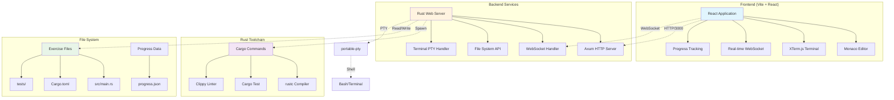
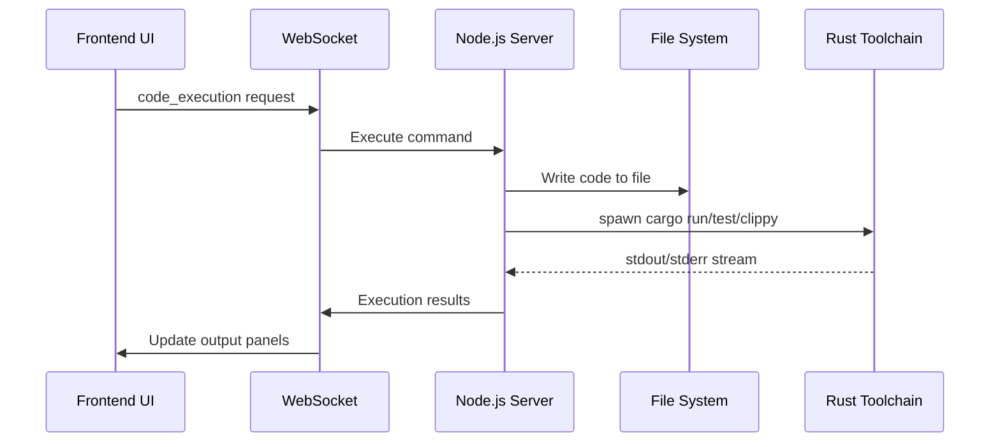

# Rust Learning Platform - Technical Documentation

## Project Overview

The Rust Learning Platform is a comprehensive, interactive web-based learning environment designed to teach Rust programming through progressive, exercise-based education following "The Rust Programming Language" book structure. The platform combines a modern web interface with real-time code execution and terminal access.

## Architecture Overview



## Architecture Decisions

### ADR-001: Remove Unused Exercise Framework
**Status**: Proposed  
**Date**: 2025-07-28  
**Link**: [ADR-001-Remove-Exercise-Framework.md](./ADR-001-Remove-Exercise-Framework.md)

The `exercise-framework` was created as a sophisticated abstraction layer for exercise management but was never integrated. The project evolved to use simpler, direct approaches that work perfectly well. This ADR documents the decision to remove this unused technical debt.

## System Architecture

### 1. Frontend Architecture

#### 1.1 Technology Stack
- **HTML5/CSS3**: Modern responsive design with CSS Grid and Flexbox
- **Vanilla JavaScript (ES6+)**: Modular architecture with ES6 modules
- **Monaco Editor**: VSCode-based code editor with Rust syntax highlighting
- **XTerm.js**: Full-featured terminal emulator
- **WebSocket API**: Real-time bidirectional communication

#### 1.2 Frontend Module Structure
```
web/src/js/
├── app.js              # Main application entry point
├── ui.js               # User interface management
├── websocket-manager.js # WebSocket communication
├── terminal.js         # Terminal management
├── progress-tracker.js # Progress tracking and persistence
└── platform.js        # Core platform logic
```

#### 1.3 UI Layout Design

The interface uses CSS Grid for the main layout with the following areas:

```css
grid-template-areas: 
  "header header header"
  "sidebar editor panel"
  "sidebar output panel";
```

**Layout Zones:**
- **Header**: Logo, progress indicator, global controls
- **Sidebar**: Exercise navigation and chapter organization
- **Editor**: Monaco Editor with action buttons
- **Output Panel**: Tabbed interface for stdout, tests, and clippy results
- **Right Panel**: Book references, hints system, exercise info
- **Terminal**: Overlay terminal with resize/minimize capabilities

### 2. Backend Architecture

#### 2.1 Server Structure
```
web/
├── server.js           # Main Node.js server
├── package.json        # Dependencies and scripts
└── dist/              # Built frontend assets
```

#### 2.2 Server Responsibilities
- **HTTP Server (Port 8000)**: Serves static frontend assets
- **WebSocket Server (Port 3000)**: Real-time communication hub
- **File System API**: Exercise file management
- **Process Management**: Cargo command execution
- **Terminal Service**: PTY-based terminal sessions

#### 2.3 WebSocket Message Protocol
```javascript
// Message structure
{
  type: "message_type",
  action: "specific_action",
  sessionId: "unique_session_id",
  data: { /* payload */ },
  timestamp: Date.now()
}
```

**Supported Message Types:**
- `exercise_view`: Track exercise viewing
- `code_execution`: Handle run/test/check commands
- `terminal`: Terminal session management
- `file_update`: File system changes
- `progress_update`: Learning progress updates

### 3. Exercise Framework

#### 3.1 Exercise Structure
Each exercise follows a standardized structure:

```
exercises/chXX_topic/exYY_name/
├── src/
│   └── main.rs         # Student implementation area
├── tests/              # Automated test cases
│   └── integration_tests.rs
├── hints.md           # Progressive hint system
├── Cargo.toml         # Exercise-specific dependencies
└── README.md          # Exercise description
```

#### 3.2 Exercise Metadata
```javascript
{
  "title": "Exercise Name",
  "description": "Exercise description",
  "difficulty": "beginner|intermediate|advanced",
  "estimated_time_minutes": 15,
  "concepts": ["ownership", "borrowing"],
  "book_references": {
    "specific_sections": [
      {
        "title": "Chapter Section",
        "url": "https://doc.rust-lang.org/book/...",
        "chapter": "4.1",
        "relevance": "core|supplementary"
      }
    ]
  }
}
```

## Implementation Details

### 1. Terminal Implementation

#### 1.1 Architecture Decision: XTerm.js + node-pty

**Why XTerm.js?**
- Full VT100/xterm terminal emulation
- Excellent performance with large outputs
- Rich theming and customization options
- Wide browser compatibility

**Why node-pty?**
- Cross-platform PTY (pseudo-terminal) support
- Proper process management and signal handling
- Native shell integration
- Maintains terminal state and history

#### 1.2 Terminal Session Management

```javascript
// Terminal session lifecycle
class TerminalManager {
  createSession() {
    this.sessionId = `terminal_${Date.now()}_${Math.random().toString(36).substr(2, 9)}`;
    // Send session creation request via WebSocket
  }
  
  handleInput(data) {
    // Forward input to backend PTY process
  }
  
  handleOutput(data) {
    // Display output in XTerm instance
  }
}
```

#### 1.3 Resize and Minimize Implementation

**Design Decision: Flexible Terminal UX**
- **Draggable resize handle**: Top edge resize with min/max constraints
- **Minimize functionality**: Collapse to header-only (40px height)
- **Double-click header**: Toggle minimize/maximize
- **Smooth transitions**: CSS transitions for better UX

```javascript
// Resize constraints
const minHeight = 100; // Allow small terminal sizes
const maxHeight = window.innerHeight * 0.8; // Maximum 80% of viewport

// State management
let isMinimized = false;
let previousHeight = 300; // Store for restoration
```

### 2. Code Execution Pipeline

#### 2.1 Execution Flow



#### 2.2 Command Execution Implementation

```javascript
// Server-side command execution
function executeCargoCommand(command, exercisePath, code) {
  return new Promise((resolve, reject) => {
    // 1. Write code to file system
    fs.writeFileSync(path.join(exercisePath, 'src/main.rs'), code);
    
    // 2. Execute cargo command
    const child = spawn('cargo', [command], {
      cwd: exercisePath,
      stdio: ['pipe', 'pipe', 'pipe']
    });
    
    // 3. Collect output streams
    let stdout = '';
    let stderr = '';
    
    child.stdout.on('data', (data) => stdout += data.toString());
    child.stderr.on('data', (data) => stderr += data.toString());
    
    child.on('close', (code) => {
      resolve({ stdout, stderr, exitCode: code });
    });
  });
}
```

### 3. Progress Tracking System

#### 3.1 Progress Data Structure

```javascript
{
  "user_id": "unique_identifier",
  "session_stats": {
    "session_start": "2023-10-01T10:00:00Z",
    "exercises_viewed": ["ch01/ex01", "ch01/ex02"],
    "total_time_minutes": 45,
    "commands_executed": {
      "run": 12,
      "test": 8,
      "check": 5
    }
  },
  "exercise_progress": {
    "ch01/ex01": {
      "status": "completed",
      "completion_time": "2023-10-01T10:15:00Z",
      "attempts": 3,
      "hints_used": [1, 2],
      "time_spent_minutes": 15
    }
  },
  "skill_progress": {
    "ownership": 0.7,
    "borrowing": 0.4,
    "lifetimes": 0.1
  }
}
```

#### 3.2 Progress Persistence

**Design Decision: Local Storage + File Backup**
- Primary storage: Browser localStorage for immediate access
- Backup: JSON file in project root for persistence
- Sync mechanism: WebSocket messages update both locations

### 4. Error Handling and Resilience

#### 4.1 WebSocket Connection Management

```javascript
class WebSocketManager {
  connect() {
    // Exponential backoff reconnection strategy
    const maxRetries = 5;
    const baseDelay = 1000; // 1 second
    
    // Retry with exponential backoff
    const retryDelay = baseDelay * Math.pow(2, attempts - 1);
  }
  
  handleDisconnection() {
    // Graceful degradation - disable real-time features
    // Show user notification about connection loss
    // Continue with local-only functionality
  }
}
```

#### 4.2 Codespaces Environment Detection

**Challenge**: Different port configurations in GitHub Codespaces
**Solution**: Dynamic URL construction based on environment detection

```javascript
// WebSocket URL determination
let wsUrl;
if (window.location.hostname.includes('github.dev')) {
  // Codespaces: Replace port 8000 with 3000 for WebSocket
  const port3000Host = window.location.hostname.replace('-8000.', '-3000.');
  wsUrl = `${protocol}//${port3000Host}/ws`;
} else {
  // Local development
  wsUrl = `${protocol}//${window.location.hostname}:3000/ws`;
}
```

## Design Decisions

### 1. Architecture Decisions

#### 1.1 Hybrid Client-Server Architecture

**Decision**: Split between static frontend (port 8000) and WebSocket service (port 3000)

**Rationale**:
- **Performance**: Static asset serving optimized separately from real-time communication
- **Scalability**: WebSocket service can be scaled independently
- **Development**: Easier debugging with separated concerns
- **Deployment**: Flexible deployment options (CDN for static assets, dedicated WebSocket servers)

#### 1.2 Vanilla JavaScript vs. Framework

**Decision**: Use vanilla JavaScript with ES6 modules instead of React/Vue/Angular

**Rationale**:
- **Learning Focus**: Reduced complexity allows focus on Rust learning
- **Performance**: No framework overhead, faster initial load
- **Dependencies**: Minimal external dependencies reduce security surface
- **Customization**: Full control over editor integration and terminal handling
- **Bundle Size**: Significantly smaller bundle for better loading in Codespaces

#### 1.3 Monaco Editor Choice

**Decision**: Microsoft Monaco Editor over CodeMirror or Ace Editor

**Rationale**:
- **VSCode Compatibility**: Familiar interface for developers
- **Language Support**: Excellent TypeScript/JavaScript ecosystem for extensions
- **Performance**: Handles large files efficiently
- **Features**: Built-in IntelliSense, minimap, command palette
- **Accessibility**: Strong accessibility features out of the box

### 2. User Experience Decisions

#### 2.1 Progressive Hint System

**Design**: Three-level hint system (Conceptual → Strategic → Implementation)

**Rationale**:
- **Learning Theory**: Scaffolded learning approach
- **Engagement**: Prevents immediate solution seeking
- **Adaptive**: Users can choose their level of assistance
- **Tracking**: Helps identify common difficulty points

#### 2.2 Integrated Terminal

**Decision**: Include full terminal access within the web interface

**Rationale**:
- **Workflow Efficiency**: Eliminates context switching to external terminal
- **Learning Value**: Students see real cargo commands and output
- **Debugging**: Direct access to rust toolchain commands
- **Professional Simulation**: Mirrors real development environment

#### 2.3 Real-time Feedback

**Decision**: WebSocket-based real-time updates for code execution

**Rationale**:
- **Engagement**: Immediate feedback improves learning
- **Performance Perception**: Streaming output feels more responsive
- **Progress Tracking**: Real-time analytics for learning insights
- **Collaboration**: Foundation for future collaborative features

### 3. Technical Decisions

#### 3.1 File System Architecture

**Decision**: Direct file system manipulation instead of in-memory code execution

**Rationale**:
- **Rust Toolchain Integration**: Cargo requires file system presence
- **Debugging Capability**: Students can inspect generated files
- **Realistic Environment**: Mirrors actual development workflow
- **Testing Support**: File-based tests work naturally
- **IDE Integration**: External tools can access exercise files

#### 3.2 Progress Data Format

**Decision**: JSON-based progress tracking with local storage + file backup

**Rationale**:
- **Simplicity**: No database setup required
- **Portability**: Progress travels with project
- **Debugging**: Human-readable format
- **Privacy**: Local-first approach
- **Offline Capability**: Works without server connection

#### 3.3 CSS Grid Layout

**Decision**: CSS Grid for main layout instead of Flexbox or JavaScript-based layouts

**Rationale**:
- **Responsive Design**: Natural responsive behavior
- **Performance**: Hardware-accelerated layout
- **Maintainability**: Declarative layout specification
- **Flexibility**: Easy to modify layout areas
- **Modern Standards**: Future-proof approach

## Performance Optimizations

### 1. Frontend Optimizations

- **Module Loading**: ES6 modules loaded asynchronously
- **Monaco Lazy Loading**: Editor components loaded on demand
- **WebSocket Buffering**: Message queuing during reconnection
- **Local Storage Caching**: Exercise metadata cached locally
- **CSS Grid**: Hardware-accelerated layout engine

### 2. Backend Optimizations

- **Process Pooling**: Reuse cargo processes where possible
- **Stream Processing**: Stream command output instead of buffering
- **Connection Pooling**: WebSocket connection reuse
- **File System Watching**: Efficient file change detection

### 3. Terminal Optimizations

- **Viewport Rendering**: XTerm.js renders only visible content
- **Resize Debouncing**: Debounced resize events to reduce reflow
- **PTY Buffering**: Efficient PTY output buffering
- **Memory Management**: Proper cleanup of terminal sessions

## Security Considerations

### 1. Code Execution Security

- **Sandboxing**: Cargo execution in isolated directories
- **Resource Limits**: Process timeout and memory limits
- **Input Validation**: All user code validated before execution
- **File System Isolation**: Exercises contained to specific directories

### 2. WebSocket Security

- **Origin Validation**: WebSocket connections validated against allowed origins
- **Message Validation**: All WebSocket messages validated and sanitized
- **Rate Limiting**: Connection and message rate limiting
- **Session Management**: Secure session token generation

### 3. Client Security

- **XSS Prevention**: All user content properly escaped
- **Content Security Policy**: Strict CSP headers
- **Local Storage**: No sensitive data in localStorage
- **HTTPS Enforcement**: Production deployment enforces HTTPS

## Deployment Architecture

### 1. Development Environment

```
Local Machine:
├── Frontend (Vite Dev Server): localhost:8000
├── Backend (Node.js): localhost:3000
└── Rust Toolchain: Direct system access
```

### 2. GitHub Codespaces

```
Codespace Environment:
├── Frontend: https://{codespace}-8000.preview.app.github.dev
├── Backend: https://{codespace}-3000.preview.app.github.dev
├── Port Forwarding: Automatic GitHub port forwarding
└── Rust Toolchain: Pre-installed in devcontainer
```

### 3. Production Deployment Options

#### Option A: Single Server
```
Production Server:
├── Nginx Reverse Proxy
├── Static Assets (CDN)
├── Node.js Backend
└── WebSocket Service
```

#### Option B: Microservices
```
Microservices:
├── CDN (Static Assets)
├── WebSocket Service (Dedicated)
├── Code Execution Service
└── Progress Database
```

## Future Enhancements

### 1. Planned Features

- **Multi-user Support**: Shared progress and leaderboards
- **Advanced Analytics**: Learning pattern analysis
- **Code Collaboration**: Real-time collaborative editing
- **Exercise Authoring**: Web-based exercise creation tools
- **Mobile Support**: Responsive design for tablets/phones

### 2. Technical Improvements

- **Service Workers**: Offline capability
- **WebAssembly**: Client-side Rust compilation
- **Container Support**: Docker-based exercise isolation
- **Database Integration**: Scalable progress storage
- **OAuth Integration**: GitHub/Google authentication

## Monitoring and Maintenance

### 1. Logging Strategy

- **Frontend**: Console logging with debug flags
- **Backend**: Structured logging with Winston
- **WebSocket**: Connection and message logging
- **Process Execution**: Cargo command logging

### 2. Error Tracking

- **Client Errors**: Automatic error reporting
- **Server Errors**: Process crash detection
- **WebSocket Errors**: Connection failure tracking
- **Compilation Errors**: User code error analysis

### 3. Performance Monitoring

- **Load Times**: Frontend bundle loading metrics
- **Execution Times**: Cargo command performance
- **Memory Usage**: Server and client memory tracking
- **WebSocket Latency**: Real-time communication metrics

---

*This documentation reflects the current implementation as of the project's initial development phase. It will be updated as the platform evolves and new features are added.*